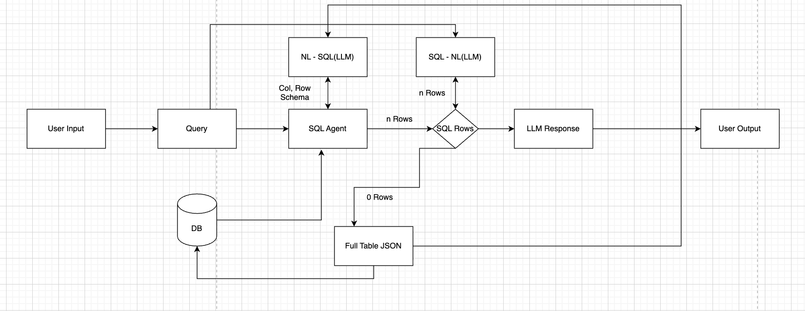

# 📊 TableTalk — Conversational Analytics for Your Excel Data

**TableTalk (TabulaRAG)** is a web application that transforms your Excel files into an intelligent, query-ready database.  
Each worksheet becomes its own database table, metadata is tracked automatically, and relations between tables are detected.  
A built-in LLM-powered chatbot lets you ask natural language questions — even across multiple sheets — and provides answers backed by your original documents.

---

## ✨ Features
- **Excel → Database** — Upload Excel files and each worksheet is ingested into SQLite (or MongoDB in future) as a separate table.  
- **Auto Metadata Tracking** — Column names, row counts, and schemas are stored automatically.  
- **Relation Discovery** — Detect and manage relationships between tables for joins.  
- **Conversational Queries** — Use natural language to query your data via an LLM-powered backend.  
- **Multi-Table Reasoning** — Ask questions that require connecting data across multiple tables.  
- **Traceability** — Answers are linked back to the exact sheet, row, and column in your original file.  

---

## 🛠 Tech Stack
- **Frontend:** Streamlit (quick prototype) / Next.js + Tailwind (future)  
- **Backend:** Python (FastAPI, pandas, SQLAlchemy/SQLite), optional MongoDB & Redis for scale  
- **AI Layer:** Ollama (Phi-4 / Llama / DeepSeek) or OpenAI/Groq APIs  
- **Storage:** Local SQLite DB (S3/R2 planned for production)  
- **ETL:** pandas for schema inference, relation detection, and ingestion  

---

## 🚀 Quick Start

### Prerequisites
- [Podman](https://podman.io/) or Docker installed  
- Python 3.10+ if running locally  

### Run with Podman
```bash
git clone https://github.com/<your-username>/tabletalk.git
cd tabletalk

# Build and start backend + frontend
podman-compose up --build
```

### Open:

- **Frontend (Streamlit):** [http://localhost:8501](http://localhost:8501)  
- **Backend (FastAPI):** [http://localhost:8000/docs](http://localhost:8000/docs)  

---

## 🛠 Run Locally (Dev mode)

### Backend
```bash
cd backend
uvicorn app.main:app --reload --port 8000
```

### Frontend
```bash
cd frontend
streamlit run app.py --server.port 8501
```

## 🏗️ System Design

